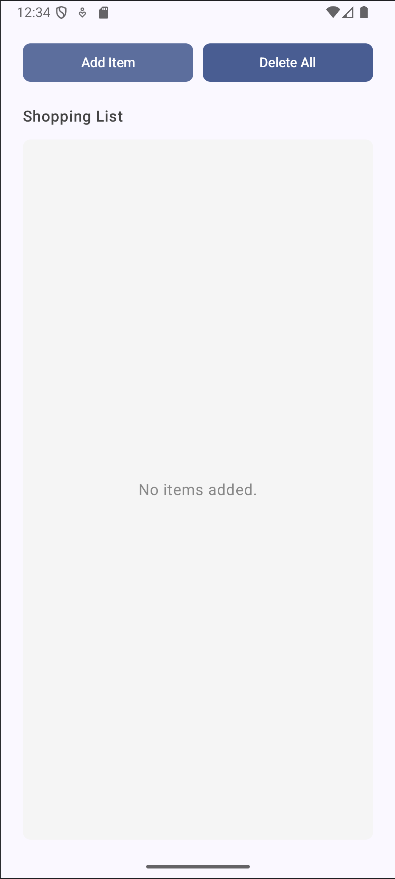

# 🛍️ Shopping List App

Aplicativo simples de lista de compras desenvolvido com **Jetpack Compose**. Permite adicionar, visualizar e remover itens da lista de forma prática e moderna.

---

## ✨ Funcionalidades

* ✅ Adicionar itens com nome e quantidade
* ✅ Listagem dinâmica dos itens adicionados
* ✅ Remoção individual de itens
* ✅ Remoção de todos os itens com um clique
* ✅ Interface moderna com Material 3

---

## 📦 Estrutura do Projeto

```bash
shoppinglist/
├── MainActivity.kt                     # Tela principal com Scaffold e lógica de estado
├── components/
│   ├── AlertDialogField.kt            # Diálogo para adicionar novos itens
│   └── ShoppingListItem.kt            # Componente para exibir um item da lista
├── data/
│   └── ShoppingItem.kt                # Modelo de dados do item da lista
├── ui/theme/                          # Tema do aplicativo (cores, tipografia etc.)
└── assets/
    └── screenshot.png                 # Imagem demonstrativa do app
```

---

## 📱 Interface

* Ao iniciar, a tela exibe dois botões: **Add Item** e **Delete All**
* Itens são exibidos em uma lista com botão para exclusão individual
* Quando não há itens, a mensagem `"No items added."` é mostrada

---

## 💠 Tecnologias Utilizadas

* Kotlin
* Jetpack Compose
* Material 3 (Material You)
* State management com `remember` e `mutableStateOf`

---

## 📸 Screenshot

> Veja uma prévia do app em funcionamento:



---

## 🚀 Melhorias Futuras (Sugestões)

* ✏️ Editar itens já adicionados
* ☕️ Persistência local com Room ou DataStore

---
